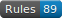

## TriHydera's Big Tech and Junk Blocklist (AdGuard)

Just some AdGuard lists I made for myself but fell free to use them if there helpful I will update whne I want to

---

## Lists

Heres the compiled list with all domains

- [Compiled List](https://github.com/TriHydera/dns-blocklist/blob/master/adguard.txt) 

Find in the `lists` folder or click on the link

- [Amazon](https://github.com/TriHydera/dns-blocklist/blob/master/lists/amazon.txt) 

- [Google](https://github.com/TriHydera/dns-blocklist/blob/master/lists/google.txt) 

- [Microsoft](https://github.com/TriHydera/dns-blocklist/blob/master/lists/microsoft.txt) 

- [Samsung](https://github.com/TriHydera/dns-blocklist/blob/master/lists/samsung.txt) 

- [Misc](https://github.com/TriHydera/dns-blocklist/blob/master/lists/misc.txt) 

- [Bad / Abused TLDs](https://github.com/TriHydera/dns-blocklist/blob/master/lists/bad-abused-tlds.txt) 

- [Twitter](https://github.com/TriHydera/dns-blocklist/blob/master/lists/twitter.txt) 
